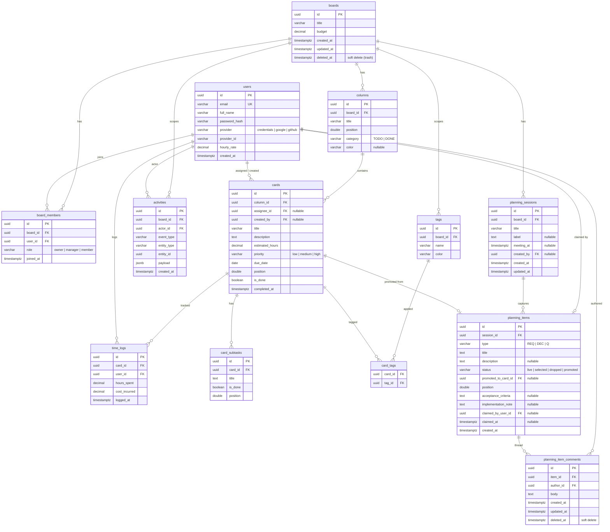

# Database

PostgreSQL 15. UUID v4 primary keys. Migrations live in [`backend/database/migrations/`](../backend/database/migrations) and run automatically on backend startup via [`internal/migrate`](../backend/internal/migrate).

## ERD



> Render: GitHub renders Mermaid natively. To export a PNG, paste this block into <https://mermaid.live>.

## Table notes

### `boards`
- `deleted_at IS NOT NULL` ⇒ board is in trash. All "list" queries filter `deleted_at IS NULL`. The trash view filters the inverse and is gated to owners only at the handler layer.
- `budget` is informational (ERP-style); not yet enforced.

### `board_members`
- `(board_id, user_id)` is unique — one role per user per board.
- The `role` column is the source of truth for permissions. Mirroring it in JWT claims would make role changes lag, so role is fetched per-request via `RequireBoardRole` middleware.

### `columns`
- `category` (`TODO` / `DONE`) is the workflow signal: cards in a `DONE` column are auto-marked complete in dashboard counts. The visible column title (`title`) is independent — a board can have "Backlog / Doing / Review / Shipped" all categorized either way.
- `position` uses **64k gap strategy** — when a card is dropped between two cards at positions 65536 and 131072, it gets 98304 (the average). Migration `000002` re-normalized existing positions to multiples of 65536 to make later reorders cheap. If two cards end up at the same position the renderer falls back to `created_at`; renormalize via the same strategy if it ever drifts.

### `cards`
- `is_done` and `completed_at` are denormalized — they're set when a card moves into a `DONE` column. This avoids a join + window function on every dashboard read.
- `assignee_id` and `created_by` use `ON DELETE SET NULL` — deleting a user does not nuke their authored work.
- `priority` is nullable on purpose: most cards don't need one.

### `card_subtasks`
- `position` is `DOUBLE PRECISION` to allow inline reordering, same idea as cards but smaller scale. No 64k normalization yet — subtask reorders are rare.

### `tags` & `card_tags`
- Tags are scoped to a board (`(board_id, name)` is unique). Two boards can have a "blocker" tag with different colors.
- `card_tags` is a pure join table; no `created_at` because tagging events are captured in `activities`.

### `activities`
- Append-only audit log. Used for the per-board activity feed and (in future) compliance trails.
- Indexed `(board_id, created_at DESC)` so the feed query is `WHERE board_id = $1 AND created_at < $2 ORDER BY created_at DESC LIMIT $3` — fast even with millions of rows.
- `payload` JSONB holds event-specific data (e.g. `{from_column: "...", to_column: "..."}` for `CARD_MOVED`). Don't query inside payload in hot paths — extract to a column if it becomes one.

### `time_logs`
- Reserved for the costing/time-tracking feature. Currently no UI writes to this table.
- `cost_incurred` is denormalized at log time so historic logs are unaffected by later `hourly_rate` changes.

### `planning_sessions`
- One row per meeting / planning session. Scoped per board (`ON DELETE CASCADE`) — deleting a board removes its sessions.
- `meeting_at` is nullable: ad-hoc capture sessions don't need a calendar slot.
- `label` is a free-text tag for cross-session grouping ("with @client", "sprint-12"). Treated as nullable but stored as TEXT so the PATCH-empty-string convention works.

### `planning_items`
- The atomic unit of the planning section. Type (REQ / DEC / Q) and status (live / selected / dropped / promoted) drive the lifecycle.
- `promoted_to_card_id` is the link back to the Kanban side. Set when `PromoteItem` runs (creates a card in the same tx). Indexed via partial index `idx_planning_items_promoted_card WHERE promoted_to_card_id IS NOT NULL` so the reverse lookup ("which planning row produced this card?") stays cheap.
- `acceptance_criteria` and `implementation_note` are free-text fields surfaced via the row's expand panel. On promote, both are copied onto the resulting `cards` row.
- `claimed_by_user_id` + `claimed_at` are the soft "I'm looking at this" claim. FK is `ON DELETE SET NULL` — a deleted user auto-releases their claims. Claim acquisition is atomic via `WHERE claimed_by_user_id IS NULL` in the UPDATE — no service-side lock needed.

### `planning_item_comments`
- Per-item conversation thread. `ON DELETE CASCADE` from `planning_items` — orphan comments aren't a thing.
- Soft delete via `deleted_at`. The list endpoint returns deleted rows too (with `body` redacted at the handler), so the UI can render tombstones without the thread shifting around.
- Partial index `(item_id, created_at) WHERE deleted_at IS NULL` keeps the common case (chronological list of live comments) cheap.

## Migrations

Versioned files in `backend/database/migrations/`:

```
000001_add_category_and_card_tracking.{up,down}.sql
000002_renormalize_card_positions.{up,down}.sql
000003_add_column_color.{up,down}.sql
000004_add_tags.{up,down}.sql
000005_add_activities.{up,down}.sql
000006_add_refresh_tokens.{up,down}.sql
000007_legacy_start_date_cleanup.{up,down}.sql    # see "When a number conflicts"
000008_add_planning.{up,down}.sql                  # planning_sessions + planning_items
000009_perf_indexes.{up,down}.sql                  # query plan tuning
000010_add_promoted_card_index.{up,down}.sql       # partial index for card→planning backlink (B-F1)
000011_add_acceptance_criteria_and_implementation_note.{up,down}.sql  # B-F3
000012_add_planning_item_comments.{up,down}.sql    # B-F5 — soft-delete table + partial index
000013_add_planning_item_claim.{up,down}.sql       # B-F6 — claimed_by + claimed_at
```

**Current applied version:** 13 — next migration claims `000014`.

### Naming + file shape

- `000XXX_short_description.{up,down}.sql` — six-digit zero-padded number, lowercase snake_case slug, both files required.
- Up should be additive when possible. Destructive changes (drop column, drop table) need a backfill plan and a heads-up to the team.
- Down must actually revert. If it can't (e.g. data loss), leave it empty with a `-- no-op: see header comment` line — `migrate down` is rarely run in production but exists for local dev.

### Claiming a number

Migration numbers are global and sequential. Two PRs both claiming `000009` will both build, both pass tests, and the second to merge will silently skip its own migration because `schema_migrations.version = 9` is already in the DB by the time it runs — leaving a dangling file with no DB effect (and possibly a real schema bug downstream when the next code change assumes the missing column exists).

**Process to avoid this:**

1. Before writing the migration, check `git fetch && git log --all -- backend/database/migrations/` for the highest in-flight number across `main` plus any open PR branches.
2. Claim your number by **opening a draft PR with the empty migration files** (just the `.up.sql` + `.down.sql` placeholders + a TODO comment). The PR reserves the number visibly.
3. If two devs hit the same number anyway: whoever merges second bumps to the next free number locally and force-pushes their branch before merging.

### When a number conflicts after merge

If a migration ships on `main` and you discover it was abandoned (reverted code, but the migration file may have applied to some devs' DBs):

1. **Keep the original number's file alive** — even if it's now a no-op. Removing it makes `golang-migrate` refuse to start on DBs that already recorded that version: `no migration found for version N: read down for version N: file does not exist`.
2. Turn the up into a guarded cleanup: `ALTER TABLE x DROP COLUMN IF EXISTS y;` — no-op on fresh DBs, cleans up on the ones that ran the original.
3. The new feature gets the next free number.

Real example: `000007_legacy_start_date_cleanup` is the placeholder for an abandoned `cards.start_date` migration. `000008_add_planning` is the actual current work; the planning tables intentionally landed at 8, not 7, because some local DBs had already applied the original 7.

### Adding a new migration (checklist)

1. Pick the next free number per "Claiming a number" above.
2. Write `00000N_short_name.up.sql` and `.down.sql`.
3. Restart backend; `internal/migrate` runs pending migrations on startup.
4. Verify: `psql` connect → `SELECT * FROM schema_migrations;` → version matches.
5. If the migration adds/changes columns, run `make sqlc` and commit the generated Go alongside the SQL — never split.

### Manual migration ops

```bash
# Run pending migrations now (without restarting the app)
docker compose exec backend /app/api -migrate-only       # not yet implemented; restart instead

# Rollback last migration
go run github.com/golang-migrate/migrate/v4/cmd/migrate \
  -source file://backend/database/migrations \
  -database "pgx5://$DB_URL" \
  down 1

# If migrate refuses to start with "Dirty database version N. Fix and force"
# — a previous migration failed mid-run. Inspect the DB, fix manually, then
# clear the dirty flag:
psql "$DB_URL" -c "UPDATE schema_migrations SET dirty = false;"
```

## Indexes

Already defined in schema:

| Index                          | Purpose                                       |
|--------------------------------|-----------------------------------------------|
| `idx_columns_board_id`         | Board view fan-out                            |
| `idx_cards_column_id`          | Per-column card list                          |
| `idx_card_subtasks_card_id`    | Card detail load                              |
| `idx_tags_board_id`            | Board tag list                                |
| `idx_card_tags_card_id`        | Card detail load (tags)                       |
| `idx_board_members_board_id`   | Membership check                              |
| `idx_board_members_user_id`    | "My boards" list                              |
| `idx_activities_board_time`    | Activity feed pagination                      |

Add an index when an `EXPLAIN ANALYZE` shows a sequential scan on a hot path. Don't pre-emptively index — it slows writes and bloats the table.

## Backups

**Not yet automated** — listed as P1 in the deploy plan. For now, manual:

```bash
docker compose exec db pg_dump -U erp_user erp_kanban > backup.sql
# restore
docker compose exec -T db psql -U erp_user -d erp_kanban < backup.sql
```
