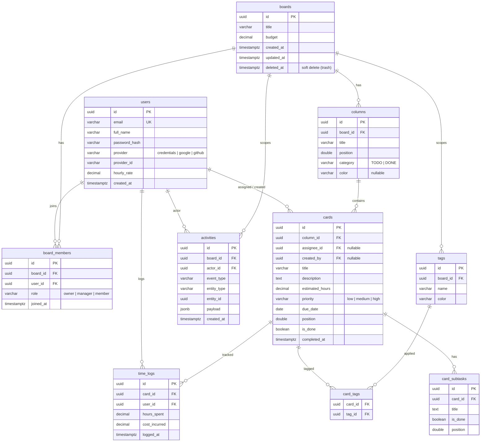

# Database

PostgreSQL 15. UUID v4 primary keys. Migrations live in [`backend/database/migrations/`](../backend/database/migrations) and run automatically on backend startup via [`internal/migrate`](../backend/internal/migrate).

## ERD



> Render: GitHub renders Mermaid natively. To export a PNG, paste this block into <https://mermaid.live>.

## Table notes

### `boards`
- `deleted_at IS NOT NULL` ⇒ board is in trash. All "list" queries filter `deleted_at IS NULL`. The trash view filters the inverse and is gated to owners only at the handler layer.
- `budget` is informational (ERP-style); not yet enforced.

### `board_members`
- `(board_id, user_id)` is unique — one role per user per board.
- The `role` column is the source of truth for permissions. Mirroring it in JWT claims would make role changes lag, so role is fetched per-request via `RequireBoardRole` middleware.

### `columns`
- `category` (`TODO` / `DONE`) is the workflow signal: cards in a `DONE` column are auto-marked complete in dashboard counts. The visible column title (`title`) is independent — a board can have "Backlog / Doing / Review / Shipped" all categorized either way.
- `position` uses **64k gap strategy** — when a card is dropped between two cards at positions 65536 and 131072, it gets 98304 (the average). Migration `000002` re-normalized existing positions to multiples of 65536 to make later reorders cheap. If two cards end up at the same position the renderer falls back to `created_at`; renormalize via the same strategy if it ever drifts.

### `cards`
- `is_done` and `completed_at` are denormalized — they're set when a card moves into a `DONE` column. This avoids a join + window function on every dashboard read.
- `assignee_id` and `created_by` use `ON DELETE SET NULL` — deleting a user does not nuke their authored work.
- `priority` is nullable on purpose: most cards don't need one.

### `card_subtasks`
- `position` is `DOUBLE PRECISION` to allow inline reordering, same idea as cards but smaller scale. No 64k normalization yet — subtask reorders are rare.

### `tags` & `card_tags`
- Tags are scoped to a board (`(board_id, name)` is unique). Two boards can have a "blocker" tag with different colors.
- `card_tags` is a pure join table; no `created_at` because tagging events are captured in `activities`.

### `activities`
- Append-only audit log. Used for the per-board activity feed and (in future) compliance trails.
- Indexed `(board_id, created_at DESC)` so the feed query is `WHERE board_id = $1 AND created_at < $2 ORDER BY created_at DESC LIMIT $3` — fast even with millions of rows.
- `payload` JSONB holds event-specific data (e.g. `{from_column: "...", to_column: "..."}` for `CARD_MOVED`). Don't query inside payload in hot paths — extract to a column if it becomes one.

### `time_logs`
- Reserved for the costing/time-tracking feature. Currently no UI writes to this table.
- `cost_incurred` is denormalized at log time so historic logs are unaffected by later `hourly_rate` changes.

## Migrations

Versioned files in `backend/database/migrations/`:

```
000001_add_category_and_card_tracking.{up,down}.sql
000002_renormalize_card_positions.{up,down}.sql
000003_add_column_color.{up,down}.sql
000004_add_tags.{up,down}.sql
000005_add_activities.{up,down}.sql
```

### Adding a new migration

1. Create `backend/database/migrations/00000N_short_name.up.sql` and `.down.sql`. Use the next sequential number.
2. Up should be additive when possible. Destructive changes (drop column, drop table) need a backfill plan and a heads-up to the team.
3. The `down` migration must actually revert. If it can't (e.g. data loss), leave it empty with a comment — `migrate down` is rarely run in production but exists for local dev.
4. Test locally: drop dev DB, recreate, restart backend → all migrations apply clean.
5. Inspect: `psql` connect, run `SELECT * FROM schema_migrations;` to confirm the version.

### Manual migration ops

```bash
# Run pending migrations now (without restarting the app)
docker compose exec backend /app/api -migrate-only       # not yet implemented; restart instead

# Rollback last migration
go run github.com/golang-migrate/migrate/v4/cmd/migrate \
  -source file://backend/database/migrations \
  -database "pgx5://$DB_URL" \
  down 1
```

## Indexes

Already defined in schema:

| Index                          | Purpose                                       |
|--------------------------------|-----------------------------------------------|
| `idx_columns_board_id`         | Board view fan-out                            |
| `idx_cards_column_id`          | Per-column card list                          |
| `idx_card_subtasks_card_id`    | Card detail load                              |
| `idx_tags_board_id`            | Board tag list                                |
| `idx_card_tags_card_id`        | Card detail load (tags)                       |
| `idx_board_members_board_id`   | Membership check                              |
| `idx_board_members_user_id`    | "My boards" list                              |
| `idx_activities_board_time`    | Activity feed pagination                      |

Add an index when an `EXPLAIN ANALYZE` shows a sequential scan on a hot path. Don't pre-emptively index — it slows writes and bloats the table.

## Backups

**Not yet automated** — listed as P1 in the deploy plan. For now, manual:

```bash
docker compose exec db pg_dump -U erp_user erp_kanban > backup.sql
# restore
docker compose exec -T db psql -U erp_user -d erp_kanban < backup.sql
```
